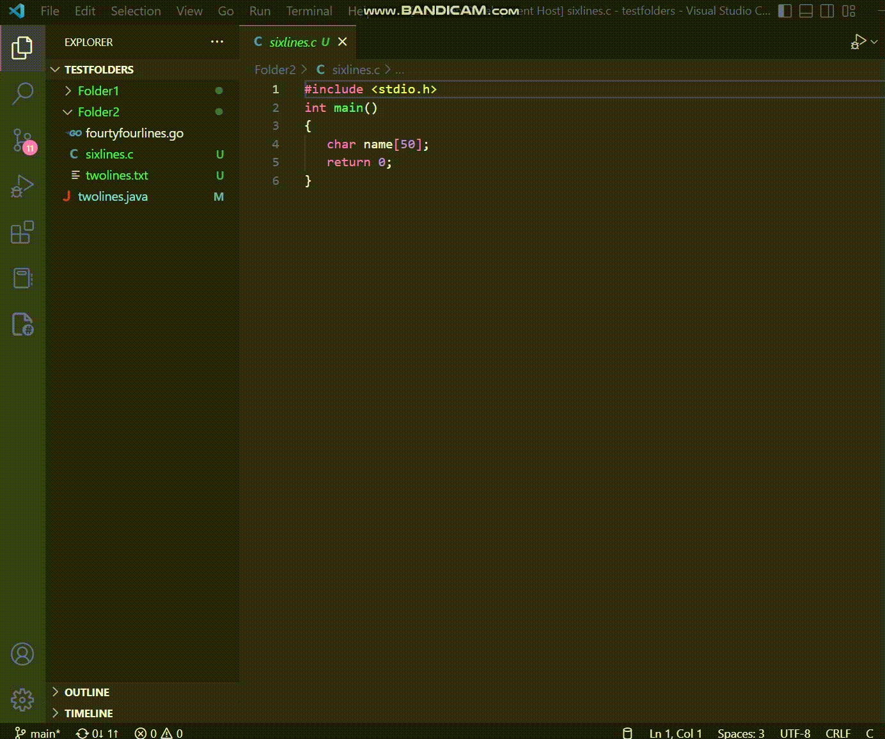

# show-line-metrics README

A plugin to show line metrics data for the currently open project.

## Features

* _Explorer_ view displays the number of line per file and per directory.

* If the files or directories you have open change then simply click refresh to update the view.

* Change what file extensions are counted in the _Configuration_ view.
    * Toggle extensions
    

    * Add additional extensions
    

    * Delete extensions
    

## Running this plugin in development

1. Download and install node.js from [nodejs.org](https://nodejs.org/en/download/)
2. Open this plugin in in VS Code 1.49+
3. `npm install`
4. `npm run compile`
5. `F5` to start debugging

In the activity bar select the ***Show Line Metrics icon*** 

## Known Issues

There are no unit tests written for this plugin do to time constraints.

:information_source: If you would like to _quickly_ manually test the plugin there is a test folder under ***src/test/testfolders***

I would have tested for the following:
* Basic functionality
    - view displays the write files and directories
    - view counts the correct number of lines per file and per directory
    - view refreshs
    - can add and delete extensions
    - check boxes work correctly
* No folder open in VS Code
* All extensions deleted
* User tries to add duplicate extension
* The formatting in the config file used to store data breaks (I should have used a simple database)
