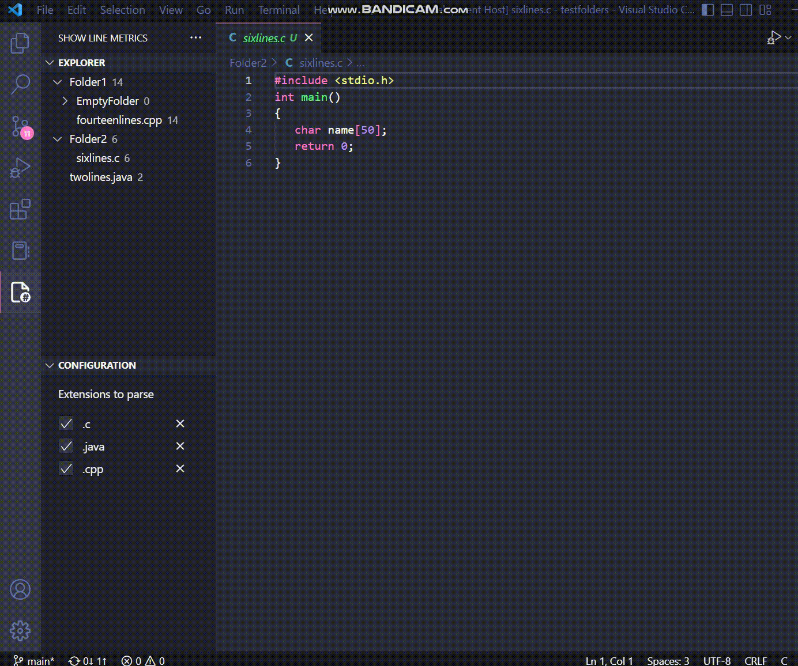
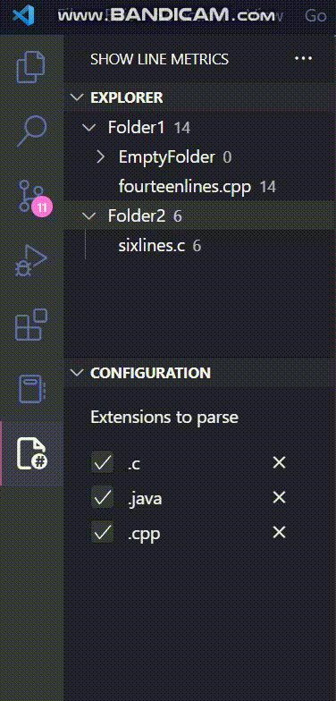
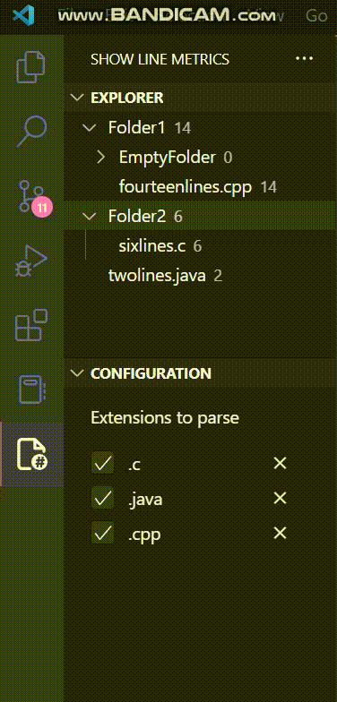

# show-line-metrics README

A plugin to show line metrics data for the currently open project.

## Features

* ~~Explorer~~ view displays the number of line per file and per directory.

* If the files or directories you have open change then simply click refresh to update the view.

* Change what file extensions are counted in the ~~Configuration~~ view.
    * Toggle extensions
    
    * Add additional extensions
    
    * Delete extensions
    

## Requirements

1. Download and install node.js from [nodejs.org](https://nodejs.org/en/download/)
2. Install the VS Code plugin library

    ```bash
    npm install -g yo generator-code`
    ```

3. Install the Webview UI Toolkit for Visual Studio Code

    ```bash
    npm install --save @vscode/webview-ui-toolkit`
    ```

## Known Issues

There are no unit tests written for this plugin do to time constraints. 
I would have tested for the following:
* Basic functionality
    - view displays the write files and directories
    - view counts the correct number of lines per file and per directory
    - view refreshs
    - can add and delete extensions
    - check boxes work correctly
* No folder open in VS Code
* All extensions deleted
* User tries to add duplicate extension
* The formatting in the config file used to store data breaks (I should have used a simple database)